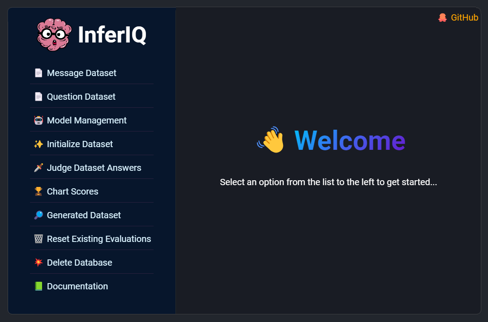

# 🧠 InferIQ
LLM Evaluation framework that leverages LLMs to Evaluate other LLMs

---

## Description
InferIQ is a NodeJS application designed to generate answers to questions using your sample dataset. After answering all dataset questions across the selected LLMs in your evaluation pool, a group of Judge LLMs will assess and rate each response. The results are then visualized in several graphs, providing a clearer picture of the overall accuracy of the LLMs. Additionally, metrics such as BERT Score and Inference Time are provided to further enhance your understanding of each LLM's performance.

---

## Setup

- run the npm setup script:  
    `npm run setup`

---

## Run

- start the application:
  `npm run server` or `npm start`

---

